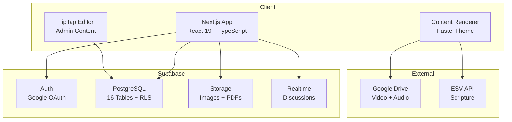
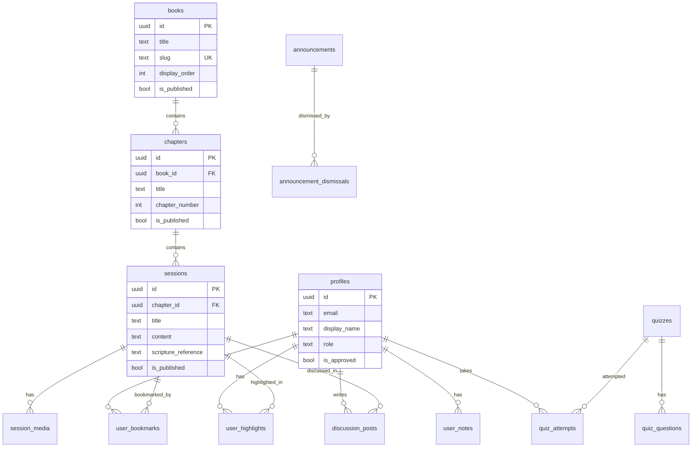
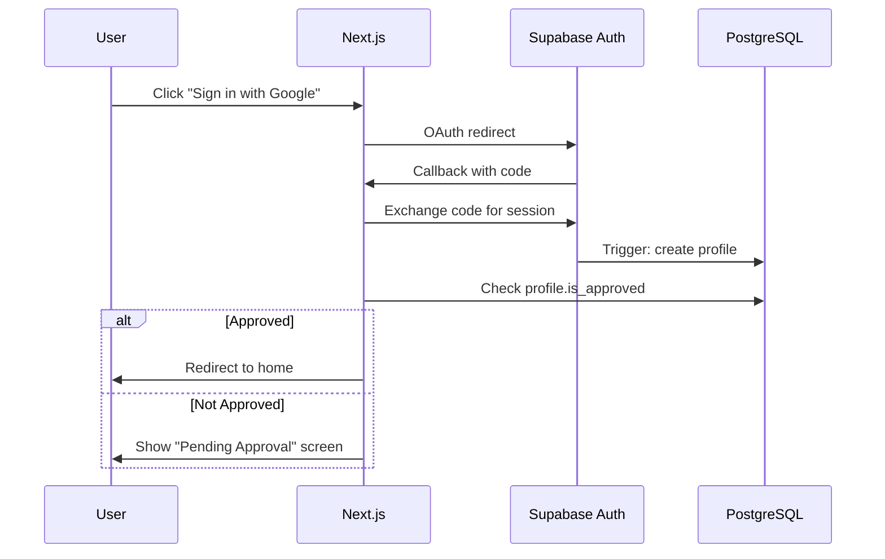

# Bible Study App

A web application for church members (~30 users) to access weekly Bible study materials, take notes, participate in discussions, and take quizzes.

## Tech Stack

- **Frontend:** Next.js 16 (App Router) + React 19 + TypeScript
- **Styling:** Tailwind CSS v4 + shadcn/ui (Base UI)
- **Backend:** Supabase (Auth, PostgreSQL, Storage, Realtime)
- **Editor:** TipTap (admin content authoring)
- **Deployment:** Vercel (frontend) + Supabase Cloud (backend)

## Architecture



## Database Schema



## Auth Flow



## Project Structure

```
bible_study/
├── app/                    # Next.js application
│   ├── src/
│   │   ├── app/           # App Router pages
│   │   │   ├── (auth)/    # Login, pending, callback
│   │   │   ├── (main)/    # User-facing pages
│   │   │   └── admin/     # Admin dashboard
│   │   ├── components/    # UI components
│   │   │   ├── ui/        # shadcn components
│   │   │   └── editor/    # TipTap editor
│   │   ├── lib/           # Utilities (Supabase clients)
│   │   └── types/         # TypeScript types
│   ├── public/            # Static assets
│   └── .env.local         # Local env vars (not committed)
├── supabase/              # Supabase configuration
│   ├── config.toml        # Local dev config
│   ├── migrations/        # SQL migrations (001-013)
│   └── seed.sql           # Test data
├── docs/                  # Planning & design docs
├── scripts/               # Utility scripts
├── .github/workflows/     # CI/CD pipeline
└── README.md
```

## Local Development

### Prerequisites

- Node.js 20+
- Docker Desktop (for local Supabase)
- Supabase CLI (`brew install supabase/tap/supabase`)

### Setup

```bash
# 1. Start local Supabase (from project root)
supabase start

# 2. Apply migrations and seed data
supabase db reset

# 3. Install app dependencies
cd app && npm install

# 4. Start dev server
npm run dev
```

The app will be available at http://localhost:3000

### Local Services

| Service | URL |
|---------|-----|
| App | http://localhost:3000 |
| Supabase Studio | http://127.0.0.1:54323 |
| Supabase API | http://127.0.0.1:54321 |
| Mailpit (emails) | http://127.0.0.1:54324 |

### Test Credentials

- **Email:** admin@bible-study.local
- **Password:** admin123

For local development, you can also sign in via the Supabase Studio dashboard.

## CI/CD

GitHub Actions runs on every push to `main` and on PRs:
- TypeScript type checking
- ESLint
- Production build

## Deployment

1. Create a Supabase Cloud project
2. Link: `supabase link --project-ref <ref>`
3. Push migrations: `supabase db push`
4. Deploy frontend to Vercel with env vars:
   - `NEXT_PUBLIC_SUPABASE_URL`
   - `NEXT_PUBLIC_SUPABASE_ANON_KEY`

## Phases

- [x] **Phase 1:** Scaffolding, auth, database schema, admin users
- [x] **Phase 2:** TipTap editor, content CRUD, content renderer, media embedding
- [x] **Phase 3:** User notes (auto-save), theme system (light/dark/sepia + font size), bookmarks
- [x] **Phase 4:** Quizzes (builder + taker), discussions (threaded), announcements, full-text search, highlights
- [x] **Phase 5:** Mobile nav, loading skeletons, error handling, back-to-top, footer
- [ ] **Phase 6:** PWA/offline, production deploy (Vercel + Supabase Cloud)
