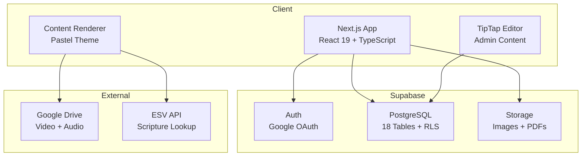
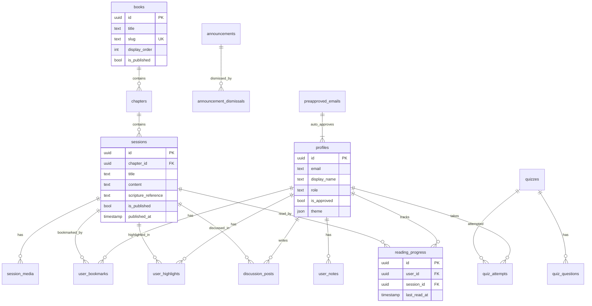
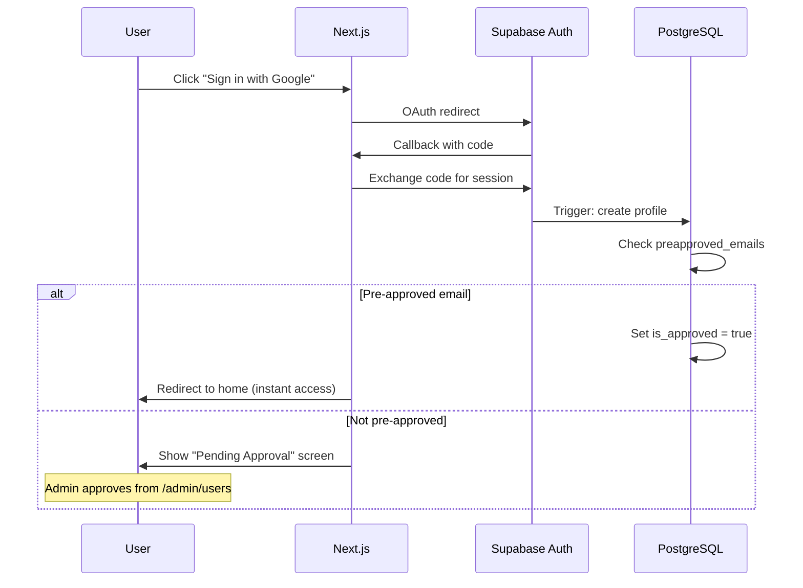

# CCISR Bible Study App

A web application for CCI San Ramon church members (~30 users) to access weekly Bible study materials, take personal notes, participate in discussions, and take quizzes.

**Live:** https://ccisr-bible-study.vercel.app  
**Repo:** https://github.com/jpurusho/bible-study

## Tech Stack

- **Frontend:** Next.js 16 (App Router) + React 19 + TypeScript
- **Styling:** Tailwind CSS v4 + shadcn/ui (Base UI)
- **Backend:** Supabase (Auth, PostgreSQL, RLS)
- **Editor:** TipTap (admin content authoring)
- **Scripture:** ESV API with caching
- **Media:** Google Drive (video/audio embedding)
- **Deployment:** Vercel (frontend) + Supabase Cloud (backend)
- **CI/CD:** GitHub Actions (lint + typecheck + build)

## Architecture



## Database Schema



## Auth Flow



## Features

### For Users
- Browse study books, chapters, sessions
- Beautiful pastel-themed content with collapsible scripture (ESV)
- Google Drive video/audio playback
- Personal notes (auto-save per session)
- Bookmarks and text highlights (with colors)
- Full-text search across all content
- Discussion threads per session
- Quizzes (multiple choice, true/false, fill-blank)
- 6 themes (light, dark, sepia, slate, forest, rose) + font size
- Reading progress tracking + "Continue Reading" card
- "New" badge on recently published content
- Mobile bottom tab navigation
- PWA installable (add to home screen)

### For Admin
- Content CRUD (books, chapters, sessions) with TipTap editor
- One-click "Publish & Announce" button
- Markdown import (paste from vim, auto-converts to HTML)
- Source/HTML view toggle in editor
- User management (approve, revoke, promote)
- Pre-approved emails (auto-approve on sign-in)
- Announcements (info/important/urgent with scheduling)
- Quiz builder
- Mobile-friendly admin dashboard with Quick Actions

## Project Structure

```
bible_study/
├── app/                    # Next.js application
│   ├── src/
│   │   ├── app/
│   │   │   ├── (auth)/    # Login, pending, callback
│   │   │   ├── (main)/    # User pages (home, books, notes, search, settings)
│   │   │   ├── admin/     # Admin (users, content, quizzes, announcements, preapproved)
│   │   │   └── api/       # API routes (bible/esv lookup)
│   │   ├── components/    # App components
│   │   │   ├── ui/        # shadcn components (Base UI)
│   │   │   └── editor/    # TipTap editor
│   │   ├── lib/           # Utilities (supabase clients, markdown-to-html)
│   │   └── types/         # TypeScript types (database.ts)
│   ├── public/            # Static assets (icons, manifest, sw.js)
│   └── vercel.json        # Vercel config
├── supabase/              # Supabase configuration
│   ├── config.toml        # Local dev config
│   ├── migrations/        # SQL migrations (001-018)
│   └── seed.sql           # Local test data
├── docs/                  # Planning & design docs
├── scripts/               # Content conversion utilities
├── .github/workflows/     # CI/CD pipeline
└── README.md
```

## Local Development

### Prerequisites

- Node.js 20+
- Docker Desktop (for local Supabase)
- Supabase CLI (`brew install supabase/tap/supabase`)
- pandoc (`brew install pandoc`) for content conversion

### Setup

```bash
# 1. Start local Supabase (from project root)
supabase start

# 2. Apply migrations and seed data
supabase db reset

# 3. Install app dependencies
cd app && npm install

# 4. Start dev server
npm run dev
```

The app will be available at http://localhost:3000

### Local Services

| Service | URL |
|---------|-----|
| App | http://localhost:3000 |
| Supabase Studio | http://127.0.0.1:54323 |
| Supabase API | http://127.0.0.1:54321 |
| Mailpit (emails) | http://127.0.0.1:54324 |

### Test Credentials

- **Email:** admin@bible-study.local
- **Password:** admin123

## Content Workflow

### Weekly Publishing (Admin)

1. Write study notes in vim as Markdown (use `scripts/md-template.md` as starter)
2. Go to Admin → Content → Session → Editor
3. Click **"Import Markdown"** → paste → Convert
4. Review in visual editor, tweak if needed
5. Add video/audio links in the Media section (Google Drive URLs)
6. Click **"Publish & Announce"** (one-click: publishes + notifies all users)

### Converting from Keynote/PDF

```bash
# Convert PDF to Markdown
./scripts/pdf-to-md.sh ~/path/to/slides.pdf output.md

# Convert Keynote to Markdown (macOS)
./scripts/keynote-to-md.sh ~/path/to/lesson.key output.md
```

### Adding Media

- Videos/Audio: Upload to Google Drive → Share link → Add in session editor Media section
- Images: Use Google Drive thumbnail URL format: `https://drive.google.com/thumbnail?id=FILE_ID&sz=w800`

## Deployment

### Production (already deployed)

- **Frontend:** Vercel at https://ccisr-bible-study.vercel.app
- **Backend:** Supabase Cloud (project ref: `avctqylfozfsoavkmxgt`)
- **Domain:** `ccisr-bible-study.vercel.app`

### Deploy changes

```bash
# From app/ directory:
cd app && vercel --prod --scope jpurushos-projects
```

### Push database migrations

```bash
# From project root:
supabase db push
```

## Scripts

| Script | Purpose |
|--------|---------|
| `scripts/dev.sh` | Start local dev environment (Supabase + Next.js) |
| `scripts/pdf-to-md.sh` | Convert PDF to Markdown via pdftotext + cleanup |
| `scripts/keynote-to-md.sh` | Convert Keynote → PDF → Markdown (macOS) |
| `scripts/md-template.md` | Starter template for weekly session notes |

## Releases

- **v1.1.0** — Content complete + ESV scripture + pre-approved emails + mobile admin
- **v1.0.0** — Initial launch with all core features
